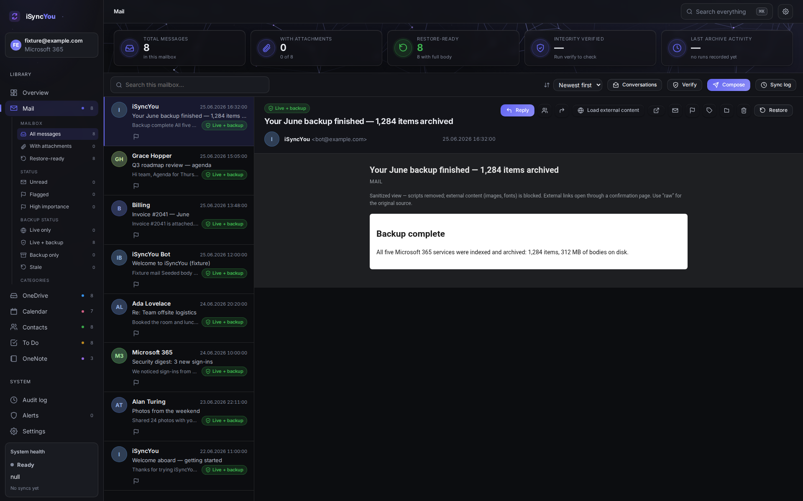
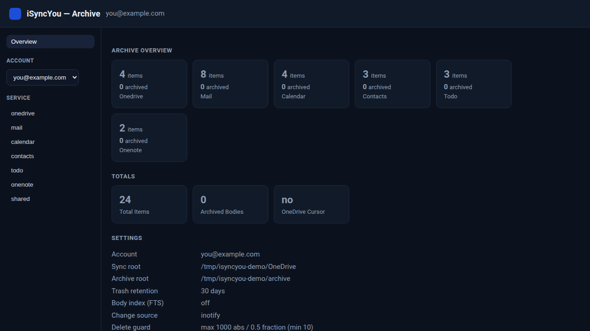
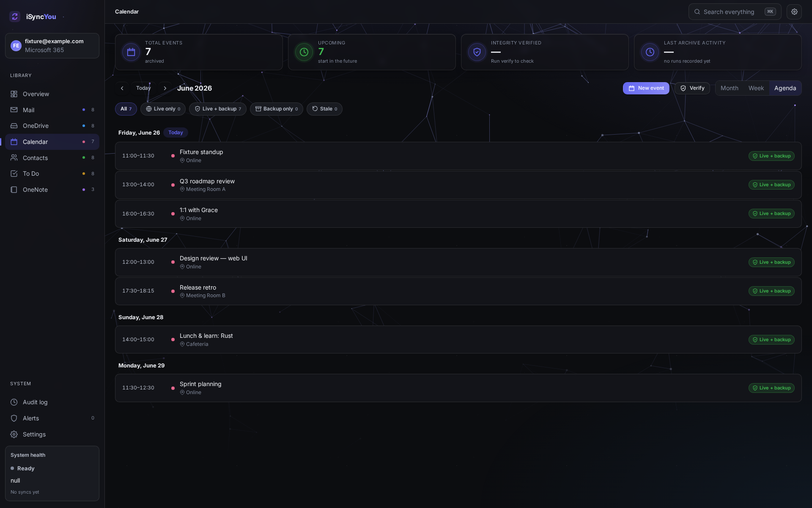
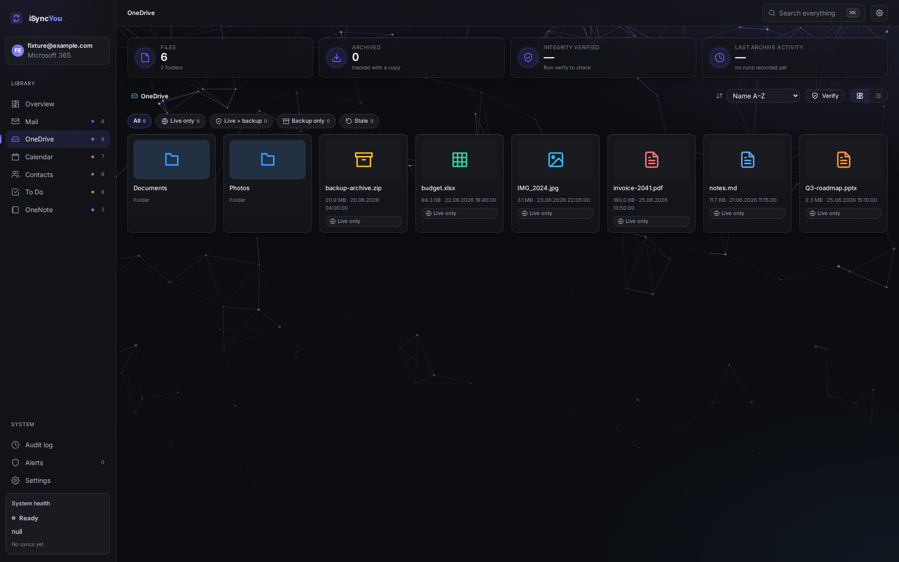
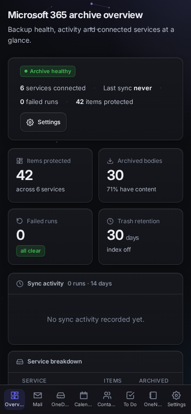
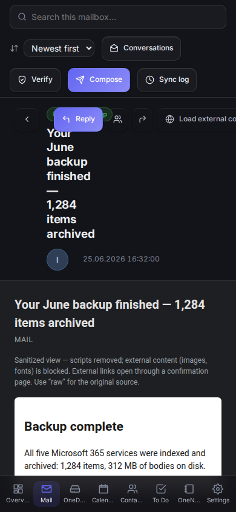
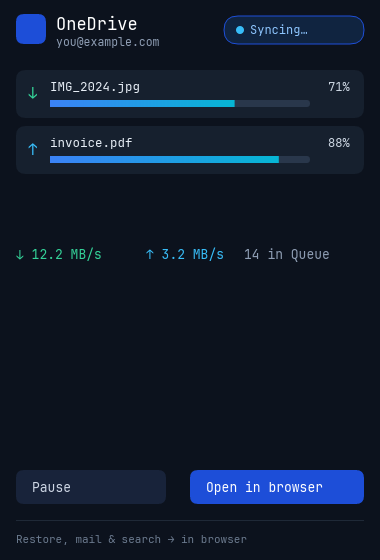
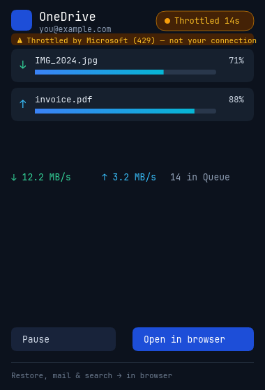

# iSyncYou

> *I sync you.* — A personal cloud sync client **and** Microsoft 365 backup &
> archive (personal/family accounts) for Linux, written in Rust.

[](#current-status)
[](https://github.com/silentspike/isyncyou/releases)
[](https://github.com/silentspike/isyncyou/actions/workflows/coverage.yml)
[](https://securityscorecards.dev/viewer/?uri=github.com/silentspike/isyncyou)
[](LICENSE)
[]()
[]()

iSyncYou keeps a Linux machine in two-way sync with **OneDrive** and keeps a
searchable, restorable on-disk **archive of the rest of Microsoft 365** — mail,
calendar, contacts, tasks and notes. It talks to Microsoft Graph directly, tracks
everything by stable item id (never by path), and stores its state in SQLite.

There is **no embedded browser engine and no GUI framework anywhere**: the native
status bar uses an own `tiny-skia` + `cosmic-text` renderer, and full control lives
in a small **local web UI** the daemon serves to your *own* browser.

This is a working product at the **release-candidate** stage — see the
[releases](https://github.com/silentspike/isyncyou/releases). What follows is
honest about what is done, what is still being hardened, and where the hard
engineering actually is.

---

## Screenshots

**Local web UI** — the daemon serves a fast, framework-free archive browser to
`localhost`: browse per account and per service, full-text search, read inert
bodies in a sandboxed reader, and run restores. No browser engine is embedded —
it's just your own browser.

<p align="center">
  
</p>

<p align="center">
  
  &nbsp;
  
</p>

<p align="center">
  
</p>

**On mobile** — the standalone Android app renders the same UI from an
**on-device embedded engine** (no daemon, no server in the loop), with a bottom
tab bar and a fully responsive layout that the CI smoke checks for horizontal
overflow at 390 px across every view.

<p align="center">
  
  &nbsp;&nbsp;&nbsp;
  
</p>

**Native status bar** — a tiny tray app rendered by an own engine (no webkit, no
GTK). It shows live transfers and is deliberately honest about throttling: when
Microsoft returns `429`, it tells you *it's Microsoft, not your line.*

<p align="center">
  
  &nbsp;&nbsp;&nbsp;
  
</p>

> Every screenshot above is rendered against **synthetic sample data**
> (`crates/connectors/examples/seed_fixture.rs`, the same token-free fixture the
> CI UI smoke drives) — no real account is involved.

---

## What it does

- **OneDrive two-way sync** — bidirectional, id-based delta sync with resumable
  up/download, reversible path mapping, a keep-both conflict engine, and a
  mass-delete guard in both directions.
- **Microsoft 365 backup & archive** — Mail, Calendar, Contacts, ToDo and OneNote:
  incremental index plus on-disk bodies (`.eml` / canonical JSON / page HTML +
  resource manifests / contact photos), **full-text search including mail bodies**,
  and `.ics` / vCard export.
- **Restore** — recover archived bodies locally, or re-create archived items as new
  cloud copies. All five backup services go through a **crash-safe operation
  ledger**; a service with no crash-safe path is *refused* rather than run unsafely.
- **Local web UI** — the daemon serves a browser UI (account/service browsing,
  search, inert body viewing, restore) on localhost. No embedded browser engine.
  **Local-only by design**: the API never listens beyond loopback/Unix-socket —
  for a headless box, tunnel it like any local service
  (`ssh -L 8765:127.0.0.1:8765 host`) or use your VPN; that keeps the
  attack surface at zero instead of shipping home-grown remote auth.
- **Native status bar + tray** — sync status, live transfers, throttle/`429`
  transparency, pause/resume, "open in browser" — rendered by an own engine.
- **Multi-account** — per-account stores; back up and search across all accounts.

Personal/family accounts via Microsoft Graph. Stateful and id-based. SQLite + FTS5.
No webkit/GTK anywhere.

---

## Why this project is interesting

The easy 80% of a sync tool is downloading and uploading files. The hard 20% — the
part this project is built around — is **doing destructive and cloud-mutating work
without ever corrupting or duplicating the user's data when something goes wrong
mid-operation.**

The sharpest example is **cloud restore**. Re-creating an archived mail item in the
cloud is two steps that are not atomic: a Graph `POST` that creates the message,
then local bookkeeping that records *"this item now exists in the cloud."* If the
process is killed, the network drops, or the token expires **between** those two
steps, a naive implementation does the worst possible thing on the next run: it
POSTs again and silently creates a **duplicate** in the user's real mailbox.

There is no transaction that spans "a remote API call" and "a local database
write." So the correctness has to come from the design:

- an **operation ledger** that records intent *before* the Graph call and the
  outcome *after* it, with an explicit state machine
  (`pending → preflight_checked → committed | failed_after_graph_commit`);
- an **idempotency key** derived from the item content (`HMAC-SHA256`) so a retry
  after a crash can recognise *"I already did this"* instead of repeating it;
- **auto-recovery on daemon start** that reconciles any operation left mid-flight;
- and a **crash matrix** of tests that kill the process at each unsafe point and
  assert *no duplicate, no loss.*

Because that surface is dangerous, **cloud restore ships disabled by default**
(`cloud_restore_enabled = false`). All five backup services (mail, calendar,
contacts, ToDo, OneNote) are ledger-backed and crash-matrix proven, each with a
live-probe-confirmed crash-recovery marker. That is the central piece of
engineering this repo is organised to prove — see
[ADR-001](docs/adr/001-restore-semantics.md) for the full restore-safety design.

---

## Current status

Honest snapshot. ✅ means implemented and exercised by tests; 🚧 means in active
hardening; ⏳ means designed and queued, not built.

| Area | State | Notes |
|---|---|---|
| OneDrive two-way sync | ✅ | id-based delta, resumable up/download, `410` reconciliation |
| Path mapping (cloud ↔ local) | ✅ | reversible encode, reserved-name/case-conflict handling, roundtrip-tested |
| Conflict engine | ✅ | keep-both default, `If-Match`/ETag (no silent overwrite) |
| Mass-delete guard | ✅ | both directions, configurable threshold |
| Throttle / 429 pacer | ✅ | full speed → backoff on `429` → probe → full speed; honours `Retry-After` |
| Upload sessions | ✅ | chunked, persisted session state, survives process kill |
| Store (SQLite + FTS5) | ✅ | id-based schema, additive migrations, WAL, single-instance lock |
| M365 backup connectors | ✅ | mail, calendar, contacts, ToDo, OneNote — incremental index |
| Unified live + backup client | ✅ all six | near-real-time cloud poll + SSE push to the web UI; live-update interval slider (1 s–60 min); four-state coverage badge per item (`live_only` · `live_backup` · `stale` · `backup_only`, store `body_etag` v10) with per-service state filters |
| Live write (cap-token-gated) | ✅ all six | mail (compose/reply/forward/flag/read/categories/move), calendar (create/update/delete), contacts (create/edit/delete + photo), ToDo (tasks/checklist/lists), OneNote (create-in-section/append/delete + notebook→section→page tree), OneDrive (quota + permissions); restore-to-original-container; writes need `X-Capability-Token` (else `401`), bodies sandboxed under the 3-layer CSP |
| Content archive | ✅ | `.eml` / canonical JSON / page HTML + OneNote resources / contact photos on disk |
| Full-text search | ✅ | names **and mail bodies**; per-account and cross-account |
| Export | ✅ | `.ics` / vCard from the archive |
| Restore — local & connector re-create | ✅ | local restore for archived bodies; connector-level re-create for mail/calendar/tasks/contacts/OneNote |
| Restore — crash-safe cloud path | ✅ all services | mail, calendar, contacts, ToDo and OneNote wired through the ledger + daemon boot recovery, crash-matrix-proven, **live-probe confirmed** (per-service recovery markers: internetMessageId · transactionId de-dup · extended property · body marker · HTML-comment); **off by default** as an opt-in (it writes to the real account) |
| Multi-account | ✅ | per-account stores, cross-account search |
| CLI + daemon | ✅ | `isyncyou` / `isyncyoud`; scheduled incremental sync |
| Change-source backend | ✅ | local-change detection wakes the sync early — an unprivileged inotify accelerator (default) or a privileged mount-wide **fanotify** backend (`change_source = "ebpf"`/`"fanotify"`; Linux, needs `CAP_SYS_ADMIN`, no per-watch limit, overflow-safe; falls back to inotify when unprivileged/unsupported). Wired into `isyncyou --watch` and the daemon; the periodic reconciler stays authoritative |
| Local web UI | ✅ | account/service browsing, search, inert body viewing; no browser engine |
| Standalone Android app | ✅ built + on-device | the same UI from an **on-device embedded engine** (no daemon/server), bottom-tab navigation, responsive at 390 px (CI smoke asserts no horizontal overflow across all views); built + CodeQL-scanned in CI, live-verified on a physical device. Not yet a published release artifact (the APK delivery is tracked in the issues) |
| Native status bar + tray (SNI) | ✅ | tray-first SNI indicator; left-click unfolds a frameless status flyout at the icon (live status) with a link into the web UI; own `tiny-skia` + `cosmic-text` renderer; display-gated |
| Dolphin overlay icons | ✅ | KF6 KIO plugin: `placeholder` / `syncing` / `materialized` emblems over DBus; host-packaged; Linux/KDE |
| FUSE on-demand placeholders | ✅ Linux | placeholder mount (browse the whole tree instantly), on-read materialize to an on-disk cache, batch-coalesced download notifications; read-only mount is non-blocking (downloads run off the dispatch thread); needs `/dev/fuse` |
| Unified read-write OneDrive folder | ✅ Linux | with a write token the placeholder mount is the single read-write folder (Windows model): edit/create/delete/rename/mkdir → OneDrive, live refresh from the cloud on browse, one KDE Places entry |
| Outbound sharing (link / invite / permissions) | ✅ | share a file/folder via Graph from the CLI (`isyncyou share` — link to clipboard, email invite `--email`, `--list`/`--revoke`), Dolphin ("Share — copy view/edit link" + "Share with people…" email invite), or the web UI ("Share" link + per-item "invite"); uses the cached `Files.ReadWrite` token (no extra consent) |
| PBS snapshot / temp restore path | ✅ local + live PBS | `VACUUM INTO` staged store + manifest, PBS backup/list/restore CLI; live temp-store round-trip confirmed against a real PBS repository |
| Acceptance harness (A1–A10) + chaos tests | ✅ | data-loss / crash-point matrix |
| Release archive + systemd unit | ✅ | tarball + `systemd --user` service |

A self-hosted staging deployment runs a nightly end-to-end suite (see
[Known limitations](#known-limitations)): its web-UI, visual-regression, migration and
verify journeys run green, while the full live-account mutation matrix is **still being
hardened** — that release-engineering work is tracked openly in the issues. Release
artifacts are built by CI with a CycloneDX SBOM and signed GitHub artifact
attestations.

---

## Install

Grab `isyncyou-linux-x86_64.tar.gz` from a
[release](https://github.com/silentspike/isyncyou/releases) (or build it yourself —
see [Build & test](#build--test)), then:

```sh
sudo install -m755 isyncyou isyncyoud isyncyou-doctor /usr/local/bin/

isyncyou init --account me --username me@outlook.com \
  --sync-root ~/OneDrive --archive-root ~/iSyncYou
isyncyou check
isyncyou login            # device-code sign-in (add --write later for restore)
```

Run the daemon (which also serves the web UI) as a `systemd --user` service — see
[`packaging/isyncyoud.service`](packaging/isyncyoud.service).

## Usage

A first sync + archive, then open the browser UI:

```sh
isyncyou sync                 # one incremental OneDrive sync
isyncyou backup               # index + archive all M365 services
isyncyou status               # per-service item + archived-body counts
isyncyou search "invoice"     # full-text search across names + mail bodies

isyncyou serve --tcp          # serve the web UI on http://127.0.0.1:8765 (loopback)
```

Then open `http://127.0.0.1:8765` in your browser for the archive UI shown above.
By default `serve` listens on an owner-only Unix socket; `--tcp` opts into a
loopback TCP transport.

### CLI reference

```
isyncyou init      # scaffold a config (template or a validated account)
isyncyou check     # validate the config
isyncyou login     # device-code sign-in; caches the token (--write for restore, --keyring for desktop keyring)
isyncyou status    # per-service item + archived-body counts
isyncyou sync      # one incremental OneDrive sync
isyncyou backup    # index + archive M365 services (--all-accounts, --service, --body-limit)
isyncyou search    # full-text search names + mail bodies (--all-accounts)
isyncyou restore   # re-create an archived item in the cloud (opt-in)
isyncyou rm        # delete a cloud item (mail / onedrive; opt-in, same gate as restore)
isyncyou export    # export archived events/contacts to .ics / .vcf
isyncyou migrate   # move an account's archive directory
isyncyou serve     # serve the local API/web UI (Unix socket by default; --tcp for loopback)
```

Token resolution: `--token` / `ISYNCYOU_TOKEN` wins; otherwise the per-account
token cached by `login` is loaded and auto-refreshed.

## Architecture

```
crates/  graph (OAuth/delta/throttle/upload) · store (SQLite+FTS5) · pathmap ·
         core (config/conflict/guard/recovery/sync-state) · change-source ·
         connectors (onedrive/mail/calendar/contacts/todo/onenote/shared/restore/
         export/mime/archive) · acceptance (A1–A10 harness)
bin/     isyncyou (CLI) · isyncyoud (daemon) · isyncyou-doctor
gui/     statusbar (own tiny-skia + cosmic-text renderer) · webui (router + minimal HTTP server)
```

The **same** status-bar renderer draws on screen *and* renders headless to a PNG,
so the UI is its own visual test harness — no display server, no browser
automation. The screenshots in this README's status-bar section are produced by
exactly that path.

## Build & test

```sh
cargo build --workspace
cargo test --workspace
cargo clippy --workspace --all-targets -- -D warnings
cargo deny check
```

Live tests against a Microsoft account are env-gated (`ISYNCYOU_TEST_TOKEN` /
`ISYNCYOU_TEST_WRITE_TOKEN`); CI without credentials skips them. The test account
is a dedicated throwaway mailbox, strictly separated from any real account, with a
unique item prefix and teardown.

## Known limitations

This section is deliberately blunt — it is the inverse of the status table.

- **Cloud restore is off by default.** It re-creates items as *new copies* (new
  ids; Microsoft 365 personal accounts offer no byte-identical import). All five
  backup services go through the crash-safe operation ledger (complete +
  live-confirmed, each with its own recovery marker); a service with no crash-safe
  path is **refused** rather than run unsafely. `cloud_restore_enabled` is `false`
  by default — a deliberate opt-in, since it writes to the real account.
- **Data at rest is only partially protected.** `isyncyou login --keyring` stores
  token JSON in the desktop Secret Service / KDE Wallet compatible keyring and
  leaves only a non-secret marker file in the archive root. Headless/file caches are
  owner-only on Unix (`0600`) and can be AES-256-GCM encrypted when a token-cache
  secret is configured (`ISYNCYOU_TOKEN_CACHE_KEY_FILE`, systemd credential
  `isyncyou-token-cache-key`, or `ISYNCYOU_TOKEN_CACHE_KEY`). Without a keyring or
  that secret, the token cache is **still encrypted at rest** with an auto-generated,
  owner-only local key kept beside it (never plaintext); that local key protects the
  cache file if it is copied/synced on its own, not against full config-dir read
  access. The SQLite store can be
  SQLCipher-encrypted via `ISYNCYOU_STORE_KEY_FILE`, systemd credential
  `isyncyou-store-key`, or `ISYNCYOU_STORE_KEY`; an existing plaintext store
  migrates in place with `isyncyou migrate --account <id> --encrypt-store`
  (atomic; refuses without a configured key). Without a store key, stores remain
  plaintext and `isyncyou-doctor` warns. Do not point plaintext stores at
  sensitive data on a shared machine.
- **A nightly staging E2E runs against a live account — its findings are the
  source of truth.** A self-hosted staging deployment runs `isyncyoud`
  (hardened systemd service, encrypted store + token caches) and a **nightly
  end-to-end run against the dedicated throwaway account** covering every user
  journey: backup of all five services, OneDrive sync, **upload + cloud teardown,
  a real two-profile edit-edit conflict (keep-both verified), cloud restore with
  teardown, archive migration round-trip, doctor**, search, restore-to-local and
  verify — plus the web UI (functional + visual regression) and the native status
  bar, with pass/fail pushed to a notification channel. No tokens ever go to CI.
  The web-UI, visual-regression, migration and verify journeys run green; the full
  live-account mutation matrix (backup / conflict / cloud-restore / teardown) is
  **still being stabilized**, and current failures are tracked openly in the issues —
  which is exactly what a source-of-truth nightly is for. Release artifacts are built
  by CI with a CycloneDX SBOM, signed GitHub artifact attestations and self-verified
  cosign signatures.
- **The windowed GUI, tray, Dolphin overlays and FUSE placeholders are built and
  live-verified on Linux/KDE, but remain platform/environment-gated.** They need a
  display server, `/dev/fuse`, or a host-side KF6 plugin respectively, so they are
  exercised by unit tests in CI and verified live on a desktop rather than in
  headless CI. With a write token the FUSE mount is the read-write unified OneDrive
  folder (edit/create/delete/rename/mkdir → OneDrive, live refresh on browse, one
  Places entry); without one it is a read-only on-demand placeholder view. The PBS
  path has deterministic local coverage plus a live test-account round-trip, but
  rerunning that live probe still requires a configured PBS repository.
- **Personal Vault and some "shared with me" data are not reachable** via Graph for
  third-party clients — these are upstream platform limits, not bugs.

## Engineering approach

This codebase is built with **AI-assisted engineering under a verification-first
protocol**: every change is gated on `fmt`, `clippy -D warnings`, the test suite,
and `cargo deny` before it can land, and no behaviour is recorded as "done" without
an executed command and its output as evidence. The interesting design decisions
(crash-safe restore semantics, the own renderer used as its own headless test
harness, the id-based reconciliation model) are written up as architecture decision
records, not buried in commits. The protocol itself is in
[`docs/ai/AI_ASSISTED_ENGINEERING_PROTOCOL.md`](docs/ai/AI_ASSISTED_ENGINEERING_PROTOCOL.md);
the restore-safety design is [ADR-001](docs/adr/001-restore-semantics.md).

## CI / release pipeline

Work flows through four branches, each with a **calibrated** gate — shift-left and
cheap on `dev`, heaviest on `staging` (the gate before production), release-grade
on `main`, attested on the RC:

| Stage | What runs |
|---|---|
| **dev** | `fmt` · `clippy -D warnings` · unit tests · MSRV · JS parse-check · **Semgrep** (JS/Kotlin/secrets SAST) · `cargo deny` · dependency review · gitleaks · a 75 % coverage gate |
| **staging** *(heaviest, pre-prod)* | a token-free **deploy + end-to-end UI smoke**, an **Android build**, **CodeQL** (Rust + JavaScript + Kotlin), an **OWASP ZAP** baseline DAST against the live UI, a CycloneDX **SBOM**, and the release build |
| **main** | the release-grade build · a **Trivy** vulnerability scan · CodeQL |
| **RC** | every merge to `main` publishes a prerelease whose artifacts are **cosign keyless-signed**, with **SLSA provenance** and an **SBOM attestation** |

Promotion between stages is an automated **tree-overlay** (the promoted tree is
byte-identical to its source), so a change is *gated*, never re-edited, on the way
up. The release **artifacts** are cryptographically signed; the **promotion**
itself is an automated bot merge, not a signed commit — that distinction, and the
full supply-chain lane, are written up in
[docs/supply-chain.md](docs/supply-chain.md).

## Docs

Design notes and matrices live in [`docs/`](docs/) — Graph capability matrix,
restore-fidelity matrix, sync-state machine, path mapping, delete/trash/conflict
model, auth/token lifecycle, SQLite/PBS snapshot consistency, local-API security,
packaging/daemon model, and [FUSE Files-on-Demand](docs/fuse-on-demand.md)
(placeholder mount, materialize-on-read, the read-write unified OneDrive folder with
live cloud refresh, download notifications, Dolphin overlays).

## Contributing

Issues and PRs are welcome. PRs are gated on `fmt`, `clippy -D warnings`, the test
suite and `cargo deny`; see [CONTRIBUTING.md](CONTRIBUTING.md) for the workflow and
[SECURITY.md](SECURITY.md) for how to report vulnerabilities.

## License

[Apache-2.0](LICENSE).
