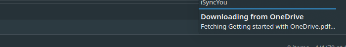
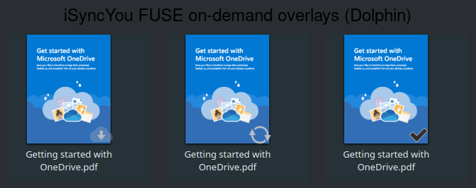

# FUSE Files-on-Demand (Linux)

iSyncYou can present an account's whole OneDrive tree as a **placeholder
filesystem**: every file shows its real size in `stat`, but its bytes are fetched
from the cloud only on first read, then cached on disk. So a multi-terabyte drive
browses instantly and downloads only what you open — the OneDrive "Files-on-Demand"
experience, on Linux, for any file-based application.

With a write token the mount is **read-write**: it is the single OneDrive folder
(the Windows model — one folder that unifies online, offline and placeholder files),
not a separate read-only view. Editing, creating, deleting, renaming and `mkdir` in
the folder propagate to OneDrive, and the folder refreshes from the cloud as you
browse so changes made on another device or the web appear here too. Without a write
token it falls back to a strictly read-only placeholder view (the original #330
behavior).

Mount an account by setting `mount_point` in its config (or `isyncyou mount
--account <id> --mountpoint <dir>`). On a KDE desktop the daemon registers the mount
as a **single Places sidebar entry** ("OneDrive") so the one folder is one click
away. The daemon clears a stale mount on start (`fusermount3 -u`) and re-mounts.

## How it works

```
Dolphin / cat / any app        kernel VFS            isyncyoud
   read(/mnt/.../file)  ──►  FUSE (fusermount3)  ──►  PlaceholderFs
                                                         │  cached?  ── yes ─► serve from <archive>/.isyncyou-fuse-cache/<id>
                                                         └─ no ─► hydration worker ─► Graph download ─► atomic write to cache ─► serve
```

- **Tree.** Built from the account's tracked OneDrive items in the store
  (`Store::all_items_by_service`); inodes, names and sizes come from the items.
- **Materialize-on-read.** The first read of a placeholder downloads the whole file
  via the Graph client into the cache **atomically** (temp file → `fsync` → rename),
  so a crash mid-download never leaves a partial/corrupt file. Later reads — and
  reads after a daemon restart — serve from the cache with no network.
- **Non-blocking.** The mount is served on one FUSE dispatch thread, so a slow
  download would otherwise freeze the *whole* mount (an `ls` of an unrelated file
  blocking for seconds). Reads that need a download are handed to a background
  **hydration worker** (the FUSE reply object is `Send`); metadata operations and
  reads of already-cached files stay responsive. The single worker also coalesces
  the kernel's read-ahead: many reads of one file trigger exactly one download.
- **Token refresh.** A placeholder mount is long-lived, so the cached read token is
  re-resolved (silent-refresh) **per fetch** rather than captured once at mount time
  — otherwise downloads would start failing after the token's ~1h lifetime.
- **Non-fatal.** A missing `/dev/fuse`, no cached token, or an unreadable store is
  logged and skipped; sync and the web UI run unaffected.

## The unified read-write folder (#478)

When a write token (`Files.ReadWrite`) is cached, the mount is read-write — the one
OneDrive folder, not a read-only view:

- **Edit** a file → uploaded to OneDrive on final close (`release`), not on every
  `flush`, so a truncate-then-write (`> file`) never blanks the cloud copy in an
  intermediate step. The original file mtime is preserved.
- **Create** a file → uploaded on first close (an empty `touch` creates an empty
  cloud file).
- **Delete / rename / mkdir** → mapped to the matching Graph operation (delete item,
  move/rename, create folder). `rmdir` requires an empty directory (POSIX).
- **Live refresh.** Browsing the folder (a throttled `readdir`, ~15 s) pulls a
  OneDrive delta into the store and reconciles the tree **inode-stably**: open file
  handles and pending local edits keep their inode, new cloud items appear, deleted
  ones disappear. So a file added/renamed/deleted on another device or the web shows
  up in the folder without restarting the daemon.
- **Writable bits.** A read-write mount reports owner-writable mode bits so file
  managers (and a pre-check `access(W_OK)`) allow create/delete/mkdir.
- **Token per operation.** Each upload/delete/move/refresh re-resolves the cached
  token (silent refresh), so a long-lived mount keeps working past the ~1h lifetime.

The tracked sync path (inotify + reconciler against `sync_root`) remains available
for users who want a full eager local copy; the placeholder mount is the on-demand,
single-folder presentation over the same store.

## Sharing from the folder (#494)

A file/folder in the mount can be shared outward via Microsoft Graph — `isyncyou
share`, the Dolphin "Share" ServiceMenu actions, or the web-UI "Share" button. The
cached write token (`Files.ReadWrite`) covers it, so no extra sign-in is needed.

```
isyncyou share <path>                      # anonymous read-only link → clipboard
isyncyou share --type edit <path>          # anonymous read-write link
isyncyou share --email a@b.com [--write] <path>   # invite a person (read|write)
isyncyou share --list <path>               # show existing permissions
isyncyou share --revoke <permission-id> <path>    # un-share
```

- The selected mount path is mapped to its cloud item by path (the mount path *is*
  the cloud path), then shared by id. `--type view|edit|embed`, `--scope
  anonymous|users`, `--password`, `--expiry` expose the full Graph option surface.
- In link mode the link is printed to stdout **and** copied to the clipboard
  (`wl-copy`/`xclip`, best-effort) with one desktop notification.
- The Dolphin ServiceMenu binds `ShareView` (`isyncyou share %F`) and `ShareEdit`
  (`isyncyou share --type edit %F`); **"Share with people…"** runs a `kdialog`
  wrapper (`isyncyou-share-invite`) that prompts for email address(es) + a
  read/write choice, then invites via `isyncyou share --email`. The web UI offers
  the same invite per OneDrive item (#504).
- Run from a GUI launcher, `isyncyou share` finds its config at
  `~/.config/isyncyou/isyncyou.toml` (the systemd-unit location) when invoked
  without `--config` from another working directory.

**Personal-account limits (honest):** the OneDrive **root** itself is not shareable
(select a file/folder inside it); `createLink` is **idempotent** per `(type, scope)`
— re-sharing returns the same link, not a duplicate; `password`/`expirationDateTime`
are Premium-dependent and `embed` is personal-only, so they may be refused on a
free personal account (the basic anonymous view/edit link and email invite are not).

## Download notifications

A hydration emits a desktop notification through the system `notify-send`. Downloads
within a short window are **batch-coalesced** into a single, in-place-updating toast
(FUSE serializes reads, so coalescing is time-windowed): "Downloading from
OneDrive — Fetching N files…", then "N files are ready offline" once the batch
drains. The same in-flight set is exposed at `/api/v1/hydrations` and shown in the
status-bar app.



## Dolphin overlay emblems

The daemon publishes a DBus `FileStatus` service; the Dolphin/KIO
`KOverlayIconPlugin` (`packaging/dolphin/overlay-plugin/`) paints a per-file emblem.
For a placeholder mount the overlay reflects the on-demand state:

| State | Emblem | Meaning |
|---|---|---|
| `placeholder` | `cloud-download` | in the cloud, not yet on disk — downloads when opened |
| `syncing` | `emblem-synchronizing-symbolic` | being downloaded right now |
| `materialized` | `emblem-checked` | hydrated to the local cache — available offline |

Paths outside a placeholder mount keep the normal store-backed sync status
(`synced` / `syncing` / `error` / `ignored`).



"Make available offline" — the Dolphin right-click ServiceMenu action `isyncyou
make-available %F` — reads the selected files/folders recursively to materialize
them now (one batch notification).

Because `KOverlayIconPlugin` is pull-based (it queries on repaint with a short cache
TTL), the transient `syncing` emblem shows on a refresh during a download; the
download notification is the always-visible in-progress signal.

## Scope / limitations

- **Write token gates read-write.** Without a cached `Files.ReadWrite` token the
  mount is read-only (the #330 placeholder behavior); with one it is the read-write
  unified folder (#478).
- **Blocking I/O on the read-write mount.** The read-write path serves on the single
  FUSE dispatch thread, so a download or upload blocks other operations until it
  finishes (the read-only mount keeps the non-blocking hydration worker). A
  non-blocking read-write mount is future work.
- **Live refresh is on browse.** Cloud changes appear on a throttled `readdir`, not
  instantly (no push channel); a directory you are not viewing refreshes the next
  time you list it.
- **Blocking reads.** A `read()` blocks until the file is materialized (POSIX); the
  notification explains the wait. Non-blocking CfAPI-style hydration is not a
  standardized Linux primitive and is out of scope.
- **Linux + `/dev/fuse`** required (built with `fuser` default-features-off →
  `fusermount3`, no `libfuse` build dependency). The overlay plugin additionally
  needs the host KF6/KIO packages.
